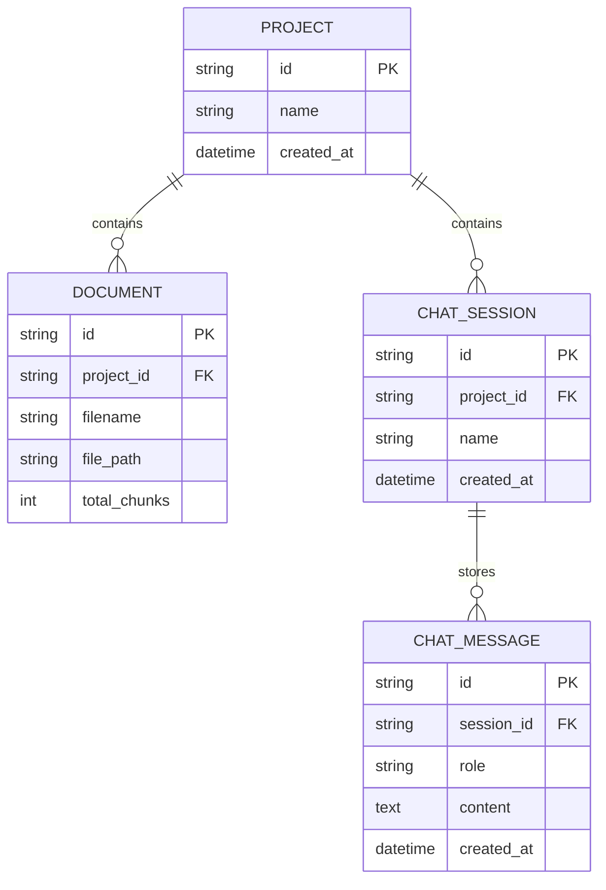

# Implementation Plan - ChatGPT-Style Projects & Sessions RAG System

A simplified, clean, and production-ready RAG application for study sessions using **FastAPI**, **Official Groq SDK**, **Pinecone Vector DB**, **Sentence Transformers**, **Rate Limiting**, **CI/CD Pipeline**, and **AWS Cloud Deployment**.

---

## Workspace Location
- **Current Path**: `d:\CODING\Development\RAG-Project2`

---

## System Architecture & Data Model

---

## Component Roadmap & Building Steps

### ✅ Component 1: Environment & Dependencies Setup (Completed & Tested)
- Clean `requirements.txt` with `fastapi`, `uvicorn`, `groq`, `sentence-transformers`, `pinecone`, `pypdf`, `slowapi`, `python-dotenv`, `pydantic`, `pytest`, `httpx`.
- Virtual environment (`venv`) created and verified.

### ⏳ Component 2: Configuration & Environment Management (`.env` + `config.py`)
- Define `.env` with `GROQ_API_KEY`, `PINECONE_API_KEY`, `PINECONE_INDEX_NAME`, `EMBEDDING_MODEL_NAME`.
- Create `backend/app/core/config.py` using `python-dotenv`.
- Test config loading.

### ⏳ Component 3: Data Schemas & Data Models (`app/models/`)
- Define Pydantic schemas for Project creation, Document uploads, Chat Sessions (`s1`, `s2`), and Chat Messages.

### ⏳ Component 4: Document Ingestion & Chunking Service (`app/services/pdf_service.py`)
- Text extraction from uploaded study PDFs using `pypdf`.
- Text chunking using `RecursiveCharacterTextSplitter`.

### ⏳ Component 5: Embedding & Pinecone Vector Store Service (`app/services/vector_service.py`)
- Generate 384-dimensional dense vectors using `SentenceTransformer('all-MiniLM-L6-v2')`.
- Upsert vectors into Pinecone with metadata filter (`project_id`).
- Query Pinecone with `project_id` filter.

### ⏳ Component 6: Groq LLM RAG Service (`app/services/rag_service.py`)
- Direct integration with `Groq` SDK (`llama-3.3-70b-versatile`).
- Prompt formatting with strict context injection and hallucination prevention.

### ⏳ Component 7: FastAPI REST API Endpoints (`app/api/`)
- `/api/v1/projects` (Create/List Projects)
- `/api/v1/projects/{project_id}/documents` (Upload PDFs)
- `/api/v1/projects/{project_id}/sessions` (Create Chat Sessions)
- `/api/v1/sessions/{session_id}/chat` (RAG Q&A)

### ⏳ Component 8: Rate Limiting, CI/CD Pipeline & AWS Deployment Guide
- Redis/memory rate limiting using `slowapi`.
- `pytest` suite for automated tests.
- Dockerfile & GitHub Actions CI/CD.
- AWS Deployment Guide (ECS/App Runner + S3 + Pinecone).
